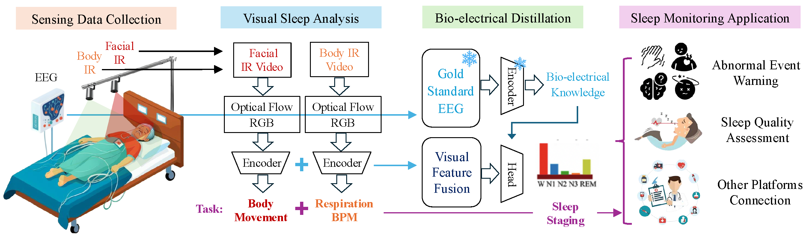

# IRSleep

This is the official project page for the IEEE Internet of Things Journal (IoTJ) paper:

**IR-Based Sleep Monitoring: Movement, Respiration, and Sleep Staging With a Structure-Aware Cross-Modal EEG Knowledge Distillation**

## Overview

<p align="center">
  
</p>

<p align="center">
  <em>
  IR-based Sleep Monitoring.
  Sensing data collection, Visual sleep analysis, Bio-electrical distillation, and Sleep monitoring applications.
  The system enables contactless monitoring and prediction of body movements, respiratory rate, and sleep stages solely from IR video.
  It further supports various smart healthcare IoT applications, including abnormal event warning, sleep quality assessment, and integration with external healthcare platforms, thereby bridging the gap between clinical sleep assessment and unobtrusive real-world sleep monitoring.
  </em>
</p>

## 📄 Citation

Please cite the paper using the following BibTeX entry:

```bibtex
@article{yu2025ir,
  title={IR-Based Sleep Monitoring: Movement, Respiration, and Sleep Staging With a Structure-Aware Cross-Modal EEG Knowledge Distillation},
  author={Yu, Zhen and Zhang, Shaoxing and Liu, Yang and Chen, Qingchao},
  journal={IEEE Internet of Things Journal},
  year={2025},
  publisher={IEEE}
}
